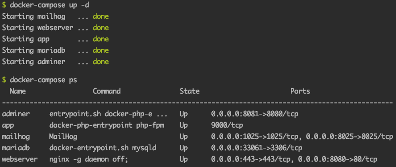

docker-compose for Laravel 6.x
=======================

Ready made development environment for Laravel 6.x using docker-compose.

Don't spent hours managing dependencies anymore. Just docker, docker-compose and git - your laravel project will be up and running in minutes!

What's Included?
------------------------  

The environment is composed with the following services -

- PHP 7.2 with fpm
    - Including all common dependencies for Laravel application
    - [Composer]
    - nodejs and npm for [Vue.js] and [Laravel-Mix]
    - ImageMagick + ghostscript (default) or gd (uncomment section) for image manipulation
- [Nginx] - web server
- [MariaDB] 10.2 - Database
- [Adminer] - light-weight database management frontend
- [MailHog] - Receive emails for dev environment (Web and API based SMTP service)

How to use
------------------

I am assuming you have basic idea about how to work with [git], [docker] and [composer] based PHP projects.
Otherwise, following the steps may not be easy for you.

#### 1. Clone this repository 
You can clone it anywhere in your local machine or download as zip file.
```shell script
git clone https://github.com/ajaxray/docker-compose-laravel.git /tmp/docker-compose-laravel  
```

#### 2. Copy required files to your project
_If you want to try with fresh Laravel project, check "Starting with fresh Laravel" below in Notes section before proceeding to this step._

Now, copy `docker-compose.yml` file and `docker` directory to project root of your laravel application
```shell script
cp -vr /tmp/docker-compose-laravel/docker* /path/to/my-project/
```

#### 3. Adjust `.env` variables 

Now, edit the .env file and set the following values:
```ini
DB_CONNECTION=mysql
DB_HOST=127.0.0.1
DB_PORT=db
DB_DATABASE=laravel
DB_USERNAME=appuser
DB_PASSWORD=123456

MAIL_HOST=mailhog
MAIL_PORT=1025
```  
Alternatively you may update parameters in `docker-compose.yml` file and set `.env` parameters accordingly.

#### 4. Get up and running 
```shell script
cd /your/laravel-project/
docker-compose up -d
# Check service status
docker-compose ps
```

If everything went OK, you should see something like this

 

#### 5. Additional Preparation 

##### Prepare Application
Common steps 
```shell script
docker-compose exec app composer install
docker-compose exec app php artisan key:generate
docker-compose exec app php artisan config:cache
docker-compose exec app php artisan migrate

# Required for Vue.js and laravel-mix
docker-compose exec app npm install
docker-compose exec app npm run dev
```

##### Prepare Database

Let's grant full permission to our database User
```shell script
docker-compose exec db bash
# Inside db container
mysql -u root -p
# pass is: 123456
MariaDB [(none)]> GRANT ALL ON laravel.* TO 'figlab'@'%' IDENTIFIED BY '123456';FLMariaDB [(none)]> FLUSH PRIVILEGES;
MariaDB [(none)]> EXIT;
# Outside db container
exit
```
 
 > Good news - **Your project is live by now!** 

Check it here:
(Following information can be different if you've modified parameter values in `docker-compose.yml`)  

- Application: http://localhost:8080/
- Database frontend : http://localhost:8081/
    - root password: 123456
    - application database user: appuser
    - application database user's password: 123456
- Email Panel: http://localhost:8025/

Important Notes
---------------
- **Starting with fresh Laravel**  

    If you have not started (or cloned) the project yet, you can start a fresh Laravel 6 project using _ONLY_ git (no other dependencies):  
   ```shell script
   git clone https://github.com/laravel/laravel.git my-project
   cd my-project
   cp .env.example .env
   ```
- **Updating PHP configuration**

    `docker/php/local.ini` is being loaded with PHP ini of `app` service. So, if you need to modify/add any ini value, you can use this file.

- **Updating Nginx configuration**

    All config files under `docker/nginx/conf.d/` will be loaded by Nginx. You can modify/add files here to modify Nginx config.  
    The application hosting is defined in `app.conf` of this directory. Check it to know log file locations and other configurations.
    
- **Updating Database configuration**

    `docker/mysql/my.cnf` is being loaded with database configuration of `db` service. So, if you need to modify/add any configuration, use it.
        
- **Connecting database from other database client**

    To avoid conflict with local MySQL, database port mapped to `33061`. That means, if you want to connect database in container from a local database client, you have to use `33061` port.

- **Selecting Image library**

    ImageMagick and ghostscript is enabled by default. If you prefer GD instead, comment out ImageMagick section and uncomment GD section in `docker/php/Dockerfile`
    
- **Add/Remove/Modify services of docker-compose**

    If you need to add/remove/modify any service anytime later (after `docker-compose up`), feel free to do. 
    Just remember to run the following commands from project directory to apply the changes -
    ```shell script
    docker-compose down
    docker-compose up --force-recreate --build -d
    docker image prune -f
    ```

[MailHog]: https://github.com/mailhog/MailHog
[Nginx]: https://www.nginx.com/
[MariaDB]: https://mariadb.org/
[Adminer]: https://www.adminer.org/
[Composer]: https://getcomposer.org/
[Laravel-Mix]: https://laravel-mix.com/
[Vue.js]: https://vuejs.org/
[git]: https://git-scm.com/
[docker]: https://www.docker.com/
[composer]: https://getcomposer.org/